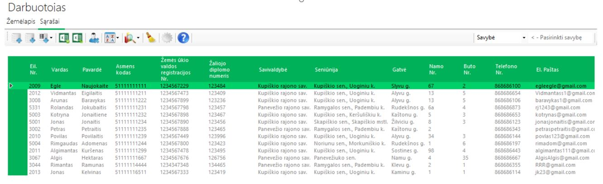
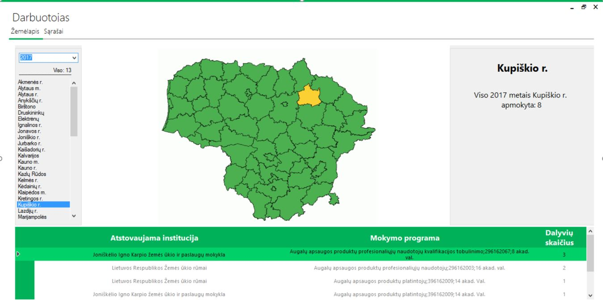

# Information processing and storing system about participants of courses in qualification improvement 
**Date**:	January 2017 – May 2017  
**Role**:	The only creator and developer  
**Technologies**:	C#, SQL, worked using MS Visual Studio 2012  

## Description	
  *	Designed a program which allows certified users to import information about participants of courses to the database
  *	Information is taken from Excel file (with a provided sheet) then imported to the application and exported to the database using SQL language
  *	Implemented user features: three types of users with specified privileges; ability to download information from database applying filters; edit every parameter of participant, sort and filter by parameters, search refresh after every user imput
  *	Created User interface: stored data could be represented in a table or an interactive country’s map, with statistics below
  *	Project was aimed to be implemented in a company

## Visual display
#### Work sheet (i. e. main window) from the employee perspective.  
  
  
#### Information displayed in a country map.  
  

