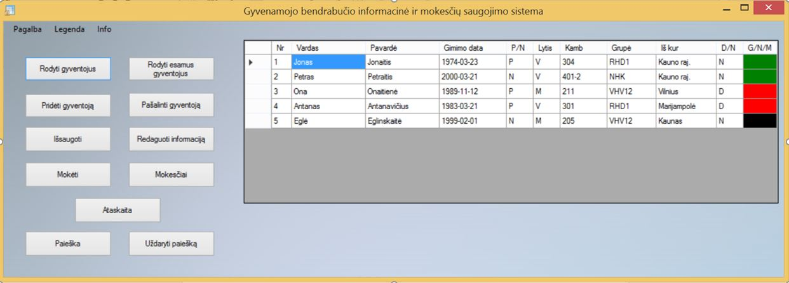

# Student dorm information and tax storage program 
**Date**:	January 2016 – May 2016
**Role**:	The only creator and developer  
**Technologies**:	C++, worked using MS Visual Studio 2012  

## Description	
* Designed a programme that can store information about dorm inhabitants and remind about monthly tax collections.  
* Implemented features: add, edit, review and delete information about the person and his/her payments.  
* User friendly UI with many informative buttons and popping messages. 

## Visual display
#### Main window
  
  
## Documentation

Documentation discribes more detailed description of a project in a Lithuanian language.
